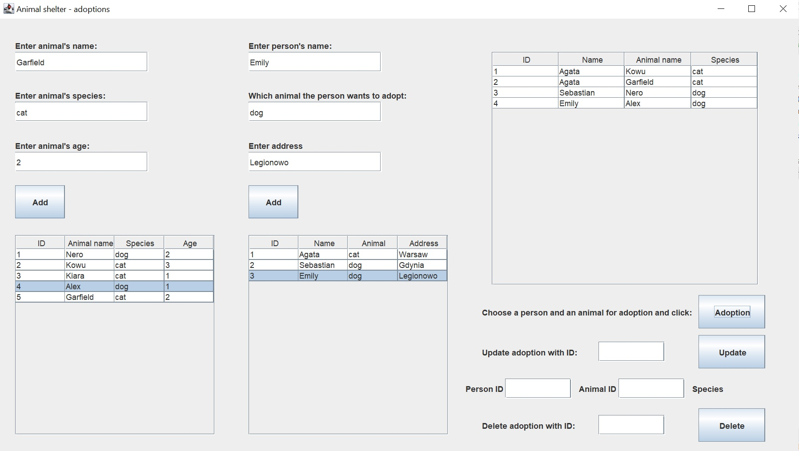

# Animal-Shelter
This is an animal shelter managment system connecting with PostgreSQL database.

 

## Features
* Adding animals and people than want to adopt them to the database
* Adding new adoptions
* Updating and deleting adoptions

## How to use
* To clone and run this application, you'll need JDK and postgreSQL with pgAdmin installed on your computer.
* First you have to create your own database.
* Then in the code in all the methods in class DataBaseConnection you have to enter the name of your database and your login and password.

## Technologies
* Java 15 with JDBC
* PostgreSQL
